> 1. `docker ps`: This command is used to list the running containers by default.

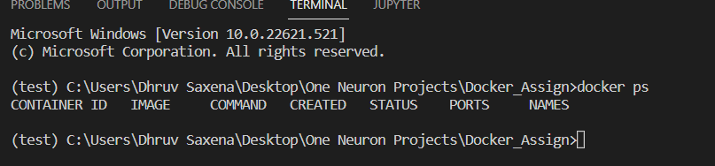

> 2. `docker pull`: This command is used to download a Docker image or a repository locally on the host from a public or private registry. When we run any container and the specified Docker image is not present locally then it first pulls it from the registry.  

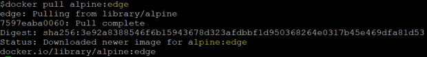

> 3. `docker build`: This command is used to builds docker images from a Dockerfile and a 'context'. A build’s context is the set of files located in the specified ``PATH`` or ``URL``.

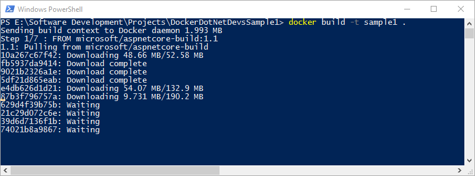

> 4. `docker run`: This command first creates a writeable container layer over the specified image, and then starts it using the specified command. 

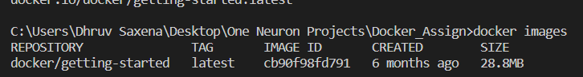

> 5. `docker images`: This command will show all top level images, their repository, tags and their size. List all local images.

> 6. `docker kill`: This command terminates the entry point process abruptly. The docker kill command causes an unsafe exit. The docker kill subcommand kills one or more containers.

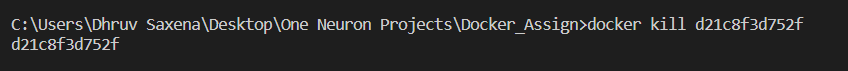

> 7. `docker stop`: This command stop the container gracefully and provides a safe way out. If a docker stop command fails to terminate a process within the specified timeout, the Docker issues a kill command implicitly and immediately.  

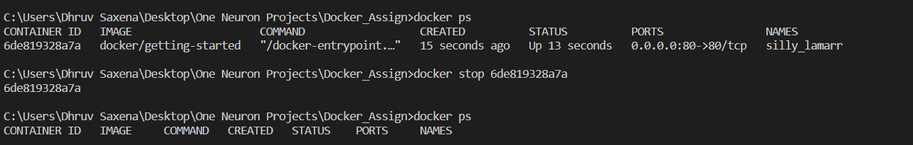

> 8. `dcoker push`: This command that is used to push or share a local Docker image or a repository to a central repository; it might be a public registry like https://hub.docker.com or a private registry or a self-hosted registry. Push an image or a repository to a registry.

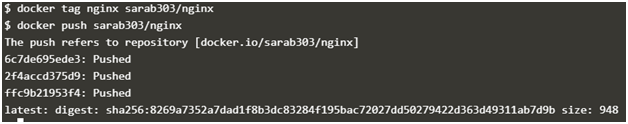

> 9. `docker search`: This command search the Docker Hub for images. Search an image on the official registry.

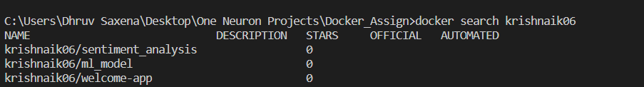

> 10. `docker save`: This command is used to save one or more than one image to a tar archive. This command is very useful when we have to use Docker images on different machines without using a registry or repository. We can also compress or save the image to a tar.gz file using gzip.

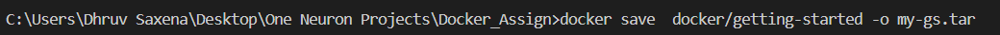

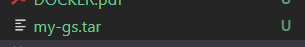

> 11. `docker pause`: This command is used to suspneds all processes in the specified container. 

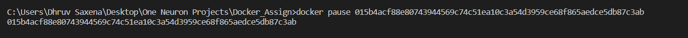

> 12. `docker rmi`: This command is used to remove one or more images from the host node. If an image has multiple tags, using this command with the tag as a parameter only removes the tag. If the tag is the only one for the image, both the image and the tag are removed.

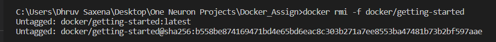

> 13. `docker commit`: This command is used to take a running container and save its current state as an image. Create a new image from a container’s changes 

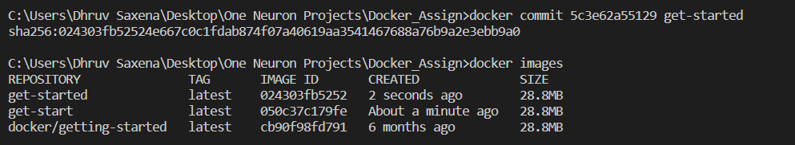

> 14. `docker history`: This command is used to show the history of an image.

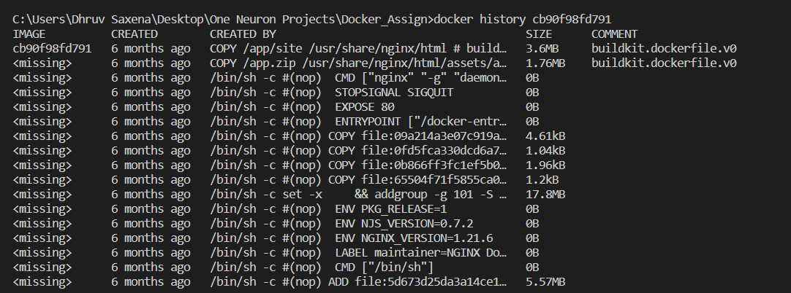

> 15. `docker `: This command is use to load an image from a tar archive or STDIN

